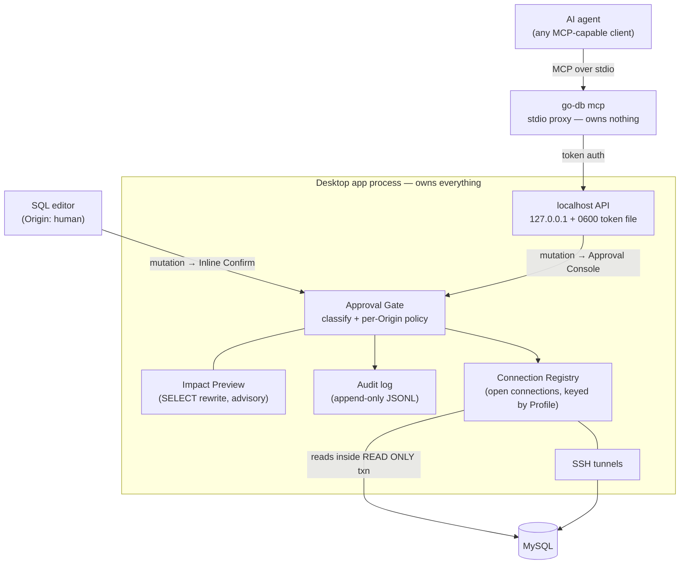

# go-db

A lightweight, beautiful desktop DB client with a human-approval gate for AI.

## Why?

Existing database clients are heavy, ugly, and risky to trust with AI agents.

**Heavy**: DBeaver routinely idles at 1–2 GB of RAM. go-db targets < 150 MB, so you can keep it open all day without guilt.

**Ugly**: Most tools are 2010-era Eclipse tooling. Linear, TablePlus, and VS Code proved that dev tools can be beautiful. go-db leads with design from day one.

**Risky**: Giving an AI agent raw database credentials is scary. It can silently INSERT, UPDATE, DELETE, or DROP. go-db enforces a single, inescapable Approval Gate: reads flow freely; mutations from ANY Origin (human or AI) must pass it. The differentiator is compatibility—works with Claude Code, Claude Desktop, Cursor, Zed, or any MCP-capable agent—not lock-in.

## How it works

### Humans: Inline Confirm
When you write an INSERT, UPDATE, or DELETE in the editor, an Impact Preview appears in place—affected-row count and a sample of rows. Statements that cannot be previewed (e.g. DDL) say "no preview available" explicitly. One extra keypress confirms; never queued.

### AI agents: Approval Console  
When an MCP-capable agent submits a mutation, it lands in a visible queue. You review the Impact Preview, approve or reject, with a ~2-minute auto-reject timeout if you step away.

### Reads: Enforced at the database
Read-only queries execute inside `START TRANSACTION READ ONLY`. Even if the classifier slips up, the database itself rejects writes. Misclassified queries get caught at the DB layer and rerouted to the gate for human approval.

## Architecture

**Single app process owns**: Profiles (where databases live), the Connection Registry (who is connected where), SSH tunnels, the Approval Gate, and the audit log. The local API binds to 127.0.0.1 only and requires a per-launch random token from a file readable only by you (0600) — other local processes and malicious web pages cannot use go-db as a database proxy.

**MCP server is thin**: A pure stdio ↔ localhost-API proxy running as a subcommand. Owns no connections, no logic, no state. Requires the app to already be running.

## Performance budget as a feature

go-db proves its lightness continuously:
- **Idle RAM < 150 MB**: You can keep it open all day.
- **Launch-to-usable < 2 s**: No Eclipse startup tax.
- **Live RAM gauge in the status bar**: The app shows you its footprint, updated in real time. This is not a promise—it is a guarantee you can verify every time you run it.

## v1 roadmap

- Connection manager: Profiles (saved database descriptions), OS keychain, SSH tunnel setup.
- SQL editor with syntax highlighting (CodeMirror 6), line wrapping.
- Results table with pagination.
- Approval Gate:
  - Inline Confirm (one-keypress approval for human mutations).
  - Approval Console (queued approval for AI mutations, ~2-min timeout).
  - Impact Preview (affected-row advisory without executing the write).
  - Database-enforced READ ONLY transaction backstop.
- MCP server mode (`go-db mcp` subcommand).
- Audit log (append-only JSONL, one record per gate decision, with the advisory preview next to the actual affected-row count).

**Beyond v1**: Postgres, multi-tab SQL editor, export (CSV, JSON), ER diagrams, per-Profile approval policies.

## Stack

**Backend**: Go 1.26+, TiDB parser (MySQL-compatible static analysis), Wails v2.

**Frontend**: Svelte 5 + TypeScript + Tailwind v4 + Vite v6, CodeMirror 6.

**Database**: MySQL first (Postgres deferred to v2).

**One binary**: The app and MCP proxy are both in one binary. The `mcp` subcommand selects the mode.

**Architecture**: Hexagonal + Deep Modules—all domain logic in `internal/`, thin adapters in `app/` (Wails) and `internal/mcp/`. Ports are Go interfaces declared by the domain package that needs them. Dependencies point inward; no circular dependencies.

## Glossary

Go-db uses specific terms to mean exact things. See [`CONTEXT.md`](CONTEXT.md) for the full glossary and rationale:

- **Origin**: SQL editor (human) or MCP agent (AI). Every query request carries its Origin.
- **Approval Gate**: The single pipeline that classifies every query and applies the Origin's policy to mutations.
- **Inline Confirm**: Human mutations get a keypress confirmation with an Impact Preview.
- **Approval Console**: AI mutations queue until human approval/rejection or ~2-min auto-reject timeout.
- **Profile**: A saved named database descriptor (host, creds, optional SSH tunnel).
- **Connection Registry**: The set of currently open database connections, keyed by Profile.
- **Impact Preview**: An advisory estimate (affected-row count, sample rows) of what a mutation will do, computed without executing it.

## License

MIT. See [`LICENSE`](LICENSE) for details.
